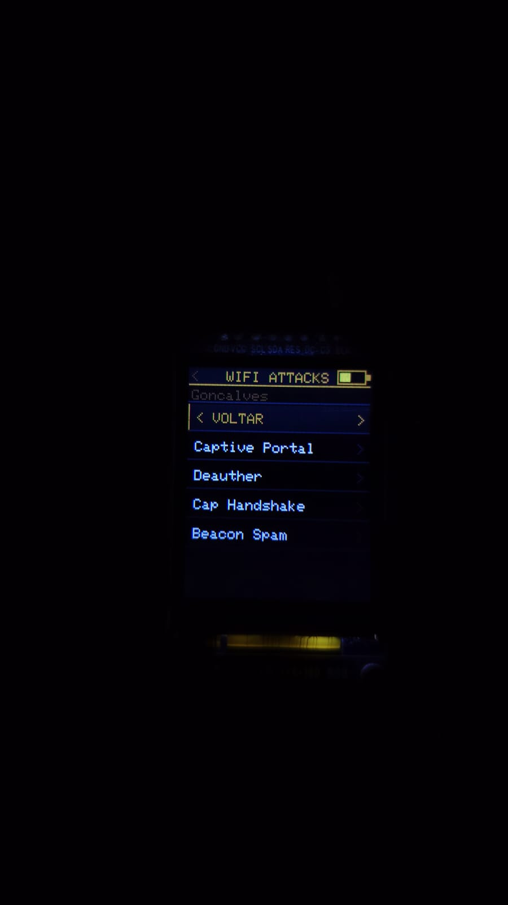
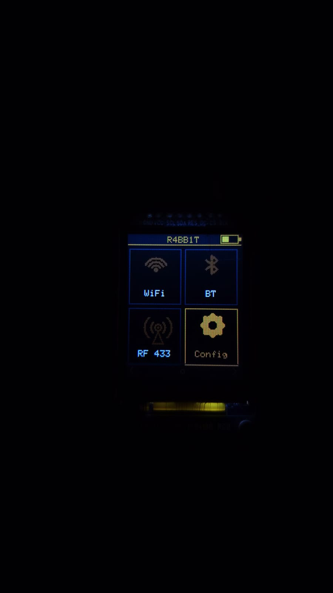
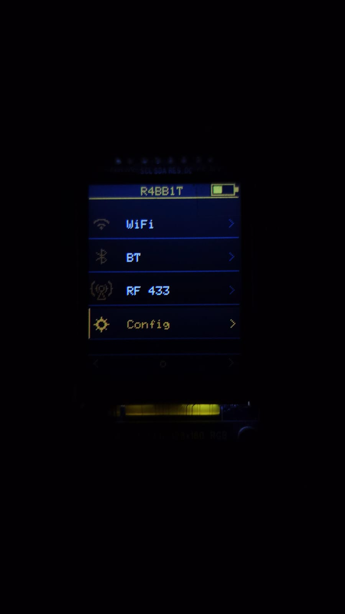
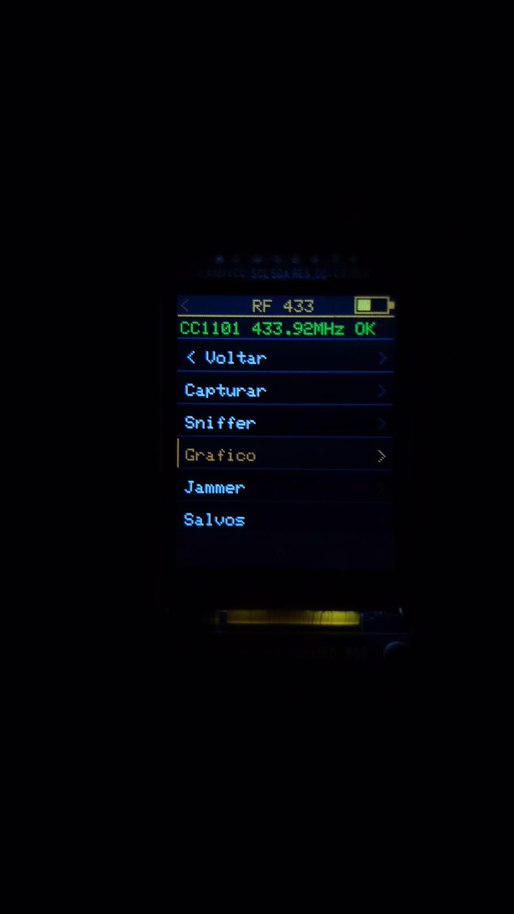
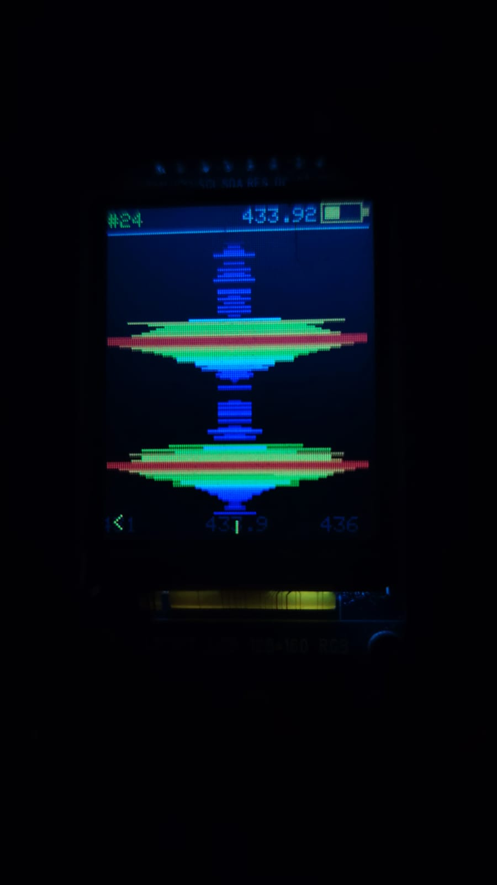

<div align="center">

# 🐇 R4BB1T FHC

**Ferramenta de Hardware para Cibersegurança baseada em ESP32**

[](https://www.espressif.com/)
[](https://www.arduino.cc/)
[](LICENSE)
[]()

</div>

---

> ⚠️ **AVISO LEGAL:** Este projeto é desenvolvido **exclusivamente para fins educacionais e de pesquisa em cibersegurança**. Todas as funcionalidades devem ser utilizadas **somente em redes e dispositivos próprios ou com autorização explícita do proprietário**. O uso indevido desta ferramenta pode constituir crime conforme a [Lei 12.737/2012 (Lei Carolina Dieckmann)](https://www.planalto.gov.br/ccivil_03/_ato2011-2014/2012/lei/l12737.htm) e outras legislações aplicáveis. **O autor não se responsabiliza por usos ilícitos.**

---

## 📖 Sobre o Projeto

O **R4BB1T FHC** é um dispositivo portátil de pentesting e análise de segurança sem fio, construído sobre o microcontrolador **ESP32**. Com um display TFT compacto e navegação por 3 botões físicos, oferece um arsenal completo de ferramentas para auditoria de redes WiFi, Bluetooth e RF, tudo em um hardware minimalista e autônomo com monitoramento de bateria integrado.

---

## ✨ Funcionalidades

### 📡 WiFi
| Ferramenta | Descrição |
|---|---|
| **Scanner de Redes** | Escaneamento de APs com RSSI, BSSID e canal |
| **Deauther** | Ataques de desautenticação em modo *Broadcast* e *Targeted* (com Scanner de Clientes em modo promíscuo) |
| **CTS Jammer** | NAV Jamming avançado na camada MAC que bloqueia o espectro do canal inteiro (Efetivo contra WPA3) |
| **Beacon Spam** | Criação de múltiplos SSIDs falsos simultâneos (com caracteres zero-width para clonagem invisível) |
| **Captive Portal** | Hotspot com página de phishing customizada para extração de credenciais |
| **Captura de Handshake** | Monitoramento e captura de handshakes WPA/WPA2 |
| **Visualizar Credenciais** | Leitura das credenciais capturadas no SPIFFS |
| **MAC Changer** | Alteração dinâmica do endereço MAC |

### 🔵 Bluetooth
| Ferramenta | Descrição |
|---|---|
| **Scan BT** | Varredura de dispositivos Bluetooth Classic e BLE |
| **Ataques BT** | Técnicas de flood e spam sobre Bluetooth |

### 📻 RF (Rádio Frequência — CC1101)
| Ferramenta | Descrição |
|---|---|
| **Replay Attack** | Gravação e repetição de sinais RF |
| **Raw Capture** | Captura de sinal bruto |
| **RF Analyser** | Análise em tempo real do espectro |
| **Random Transmit** | Transmissão de dados aleatórios |
| **Saved Signals** | Gerenciamento de sinais gravados |

### 📡 NRF24L01 (2.4 GHz)
| Ferramenta | Descrição |
|---|---|
| **Jammer 2.4 GHz** | Inundação de todos os 125 canais do espectro 2.4 GHz, interrompendo comunicações WiFi, Bluetooth e periféricos sem fio |
| **Scan de canais** | Varredura de atividade por canal no espectro 2.4 GHz |

### ⚙️ Sistema
- **Storage UI**: Interface gráfica de gerenciamento do armazenamento interno com gráfico de disco em "Donut" e navegação nativa de pastas.
- **File Viewer**: Leitor nativo diretamente na tela para arquivos de texto (`.txt`, `.csv`) e renderizador de imagens (`.bmp`) com suporte a *scroll*.
- **Persistência de Configurações** via NVRAM (salva nível de brilho, modo de menu e MAC falso selecionado).
- **UI "Cyber Edition"**: Interface totalmente customizada com temas dourados/neon, animações de micro-interações, redraws parciais otimizados (zero *flickering* / tela piscando) e modos de grade/lista.
- **Monitoramento de bateria** com barra gráfica de precisão, divisor de tensão e desligamento automático em nível crítico (≤5%).
- **Screensaver** adaptável contra burn-in no display.
- **Testar Tela**: 11 animações fluidas e interativas (Matrix Rain, Cubo 3D, Plasma, Tesseract 4D, Corredor, e olhos animados com física de movimento) acessíveis em Configurações → Testar Tela.
- **Ajuste de brilho** do display dinâmico via PWM suave.
- **Splash screen** de inicialização lendo imagem BMP colorida direto do SPIFFS.
- **Navegação universal**: Máquina de estados unificada com sistema robusto de botão "Voltar" (Back) em todas as telas.

---

## 📸 Galeria
<div align="center">
  
  
  <br>
  
  
  <br>
  
</div>

---

## 🔧 Hardware

### Componentes Necessários

| Componente | Modelo / Especificação |
|---|---|
| Microcontrolador | ESP32 (Wemos S2 Mini ou equivalente) |
| Display | TFT ST7735 / ST7789 128×160 px |
| Módulo RF | CC1101 |
| Botões | 3× botões tácteis |
| Bateria | LiPo com circuito de proteção |
| Carregador | TP4056 |

### Circuito Divisor de Tensão (Bateria)
Para que o ESP32 consiga ler a tensão da bateria LiPo com segurança (máx 4.2V), é necessário utilizar um divisor de tensão, já que o pino ADC suporta no máximo ~3.3V.

<div align="center">
  
</div>

### Pinagem

#### Display TFT
| Pino ESP32 | Função TFT |
|---|---|
| GPIO 23 | MOSI |
| GPIO 5 | SCLK |
| GPIO 17 | DC |
| GPIO 16 | RST |
| GPIO 21 | Backlight (BL) |
| — | CS (sem seleção / -1) |

#### Botões
| Pino ESP32 | Função |
|---|---|
| GPIO 14 | Botão ESQUERDA |
| GPIO 27 | Botão DIREITA |
| GPIO 26 | Botão SELECT |

#### CC1101 (RF)
| Pino ESP32 | Função CC1101 |
|---|---|
| GPIO 33 | SCK |
| GPIO 19 | MISO |
| GPIO 13 | MOSI |
| GPIO 25 | CS |
| GPIO 2 | GDO0 |
| GPIO 32 | GDO2 |

---

## 🚀 Como Compilar e Gravar

### Pré-requisitos
- [Arduino IDE 2.x](https://www.arduino.cc/en/software) ou superior
- Suporte à placa ESP32 instalado via Boards Manager:
  ```
  https://raw.githubusercontent.com/espressif/arduino-esp32/gh-pages/package_esp32_index.json
  ```

### Bibliotecas Necessárias
Instale pelo **Library Manager** do Arduino IDE:

| Biblioteca | Autor |
|---|---|
| `TFT_eSPI` | Bodmer |
| `ESPAsyncWebServer` | Me-No-Dev |
| `AsyncTCP` | Me-No-Dev |
| `SmartRC-CC1101-Driver-Lib` | lsatan |
| `rc-switch` | sui77 |

### Configuração do `TFT_eSPI`
Edite o arquivo `User_Setup.h` da biblioteca `TFT_eSPI` para corresponder ao seu display. Consulte [`Config.h`](Config.h) para os pinos utilizados.

### Gravação do SPIFFS
O diretório `data/` contém os arquivos do sistema de arquivos (splash screen BMP e página HTML do captive portal). Para enviar ao ESP32:

1. Instale o plugin [Arduino ESP32 LittleFS/SPIFFS Data Upload](https://github.com/me-no-dev/arduino-esp32fs-plugin)
2. Vá em **Ferramentas → ESP32 Sketch Data Upload**

### Patch de Injeção de Pacotes WiFi (Bypass) ⚠️
Para que os ataques WiFi (Deauther, Beacon Spam) funcionem corretamente sem serem bloqueados pelos filtros do driver nativo da Espressif, é **obrigatório** aplicar um patch na biblioteca pré-compilada. 
1. Feche o Arduino IDE.
2. Execute o arquivo `patch_libnet.bat` (Windows) ou `patch_libnet.sh` (Linux/macOS) que acompanha o repositório. (Dê permissão de execução no Linux/macOS: `chmod +x patch_libnet.sh`).
3. Aguarde a mensagem de sucesso. Este procedimento contorna o bloqueio de envio de pacotes de gerenciamento forjados.

### Compilar e Gravar
1. Abra `r4bb1t_fhc.ino` no Arduino IDE
2. Selecione a placa: `ESP32 Dev Module`
3. Configure a velocidade de gravação: `921600`
4. Clique em **Upload** (▶)

---

## 📁 Estrutura do Projeto

```
r4bb1t_fhc/
├── r4bb1t_fhc.ino       # Sketch principal (setup + loop + máquina de estados)
├── Config.h             # Definição de pinos e constantes globais
├── Globals.h / .cpp     # Variáveis globais e objetos compartilhados
│
├── Attacks.h / .cpp     # Implementação dos ataques WiFi (deauth, beacon)
├── Captive.h / .cpp     # Lógica do Captive Portal
├── Scanner.h / .cpp     # Scanner de redes WiFi
├── Radio.h / .cpp       # Interface com módulo CC1101 (RF)
│
├── Menu_Main.h / .cpp   # Menu inicial
├── Menu_Attacks.h / .cpp# Submenus de ataques WiFi
├── Menu_BT.h / .cpp     # Menu e ataques Bluetooth
├── Menu_NRF24.h / .cpp  # Suporte NRF24L01 (reservado)
├── Menu_RF.h / .cpp     # Menu de ferramentas RF (CC1101)
├── Menu_Config.h / .cpp # Tela de configurações do sistema
├── Menu_Networks.h / .cpp# Seleção de redes
│
├── Battery.h / .cpp     # Leitura ADC e monitoramento de bateria
├── HWProbe.h / .cpp     # Diagnóstico de hardware
├── Splash.h / .cpp      # Tela de inicialização (BMP do SPIFFS)
├── UI.h / .cpp          # Utilitários de interface (desenho, backlight)
│
├── wsl_bypasser.h / .c  # Bypass de limitação de canal WSL (802.11)
│
└── data/
    ├── index.html       # Página do Captive Portal (phishing page)
    └── r4bb1t.bmp       # Imagem da splash screen
```

---

## 🙏 Créditos e Referências

Este projeto foi construído sobre trabalho incrível da comunidade open-source. As seguintes partes do código têm origem em projetos externos, devidamente creditados:

### 🎨 Animações de Tela — ESP32-third-eye

As animações da funcionalidade **"Testar Tela"** (Matrix Rain, Cubo 3D, Plasma, Tesseract 4D, Corredor, olhos com física de movimento, etc.) foram portadas e adaptadas do projeto **ESP32-third-eye**:

- **Autor:** [@Jekyllz](https://github.com/Jekyllz/ESP32-third-eye) / comunidade  
- **Repositório original:** [`ESP32-third-eye`](https://github.com/Jekyllz/ESP32-third-eye) *(incluído como submódulo em `ESP32-third-eye/`)*
- **Adaptações realizadas:** conversão de `Arduino_GFX` (canvas 240×240 circular) para `TFT_eSPI` direto (128×160 retangular), reescala de coordenadas, preservação completa da lógica de física e fluidez das animações.

### 📡 Jammer NRF24L01 — nRF24_jammer

A lógica de jamming 2.4 GHz do módulo **NRF24L01** (`Menu_NRF24.cpp`) foi baseada e portada do projeto **nRF24_jammer**:

- **Autor:** [@W0rthlessS0ul](https://github.com/W0rthlessS0ul)
- **Repositório original:** [https://github.com/W0rthlessS0ul/nRF24_jammer](https://github.com/W0rthlessS0ul/nRF24_jammer)
- **Adaptações realizadas:** substituição do display OLED e botões originais pelo driver `TFT_eSPI` e pinagem GPIO do hardware R4BB1T FHC; integração ao sistema de menus e máquina de estados existente.

---

## 🤝 Contribuindo

Pull requests são bem-vindos! Para mudanças maiores, abra uma issue primeiro para discutir o que você gostaria de alterar.

1. Faça um Fork do repositório
2. Crie sua branch: `git checkout -b feature/nova-funcionalidade`
3. Commit suas mudanças: `git commit -m 'feat: adiciona nova funcionalidade'`
4. Push para a branch: `git push origin feature/nova-funcionalidade`
5. Abra um Pull Request

---

## 📜 Licença

Distribuído sob a licença MIT. Veja [`LICENSE`](LICENSE) para mais informações.

---

<div align="center">

Feito com ❤️ por **Mr4bb1t** — para aprender, pesquisar e nunca parar de questionar.

</div>
