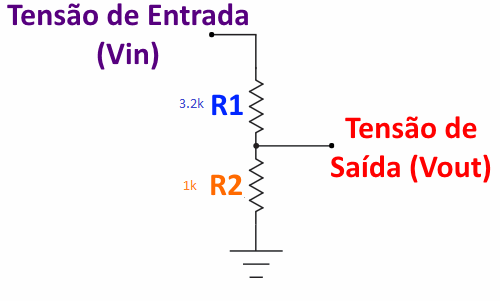

<div align="center">

# 🐇 R4BB1T FHC

**Ferramenta de Hardware para Cibersegurança baseada em ESP32**

[](https://www.espressif.com/)
[](https://www.arduino.cc/)
[](LICENSE)

</div>

---

> ⚠️ **AVISO LEGAL:** Uso exclusivamente para fins educacionais e de pesquisa em cibersegurança. Utilize somente em redes e dispositivos próprios ou com autorização explícita. Violação pode configurar crime conforme a [Lei 12.737/2012](https://www.planalto.gov.br/ccivil_03/_ato2011-2014/2012/lei/l12737.htm). **O autor não se responsabiliza por usos ilícitos.**

---

## Funcionalidades

### WiFi
| Ferramenta | Descrição |
|---|---|
| **Scanner de Redes** | Escaneamento de APs com RSSI, BSSID e canal |
| **Deauther** | Desautenticação Broadcast e Targeted (com scanner de clientes em modo promíscuo) |
| **CTS Jammer** | NAV Jamming na camada MAC — bloqueia o espectro do canal (efetivo contra WPA3) |
| **Beacon Spam** | Múltiplos SSIDs falsos simultâneos (zero-width chars para clonagem invisível) |
| **Captive Portal** | Hotspot com página de phishing para extração de credenciais |
| **MAC Changer** | Alteração dinâmica do endereço MAC (via menu de Configurações) |


### Sub GHz — CC1101
| Ferramenta | Descrição |
|---|---|
| **Replay Attack** | Gravação e repetição de sinais RF (sintoniza na freq detectada) |
| **Raw Capture** | Captura de sinal bruto (sintoniza na freq detectada) |
| **RF Analyser** | Análise em tempo real do espectro com **Detecção Automática de Frequência** (varre o espectro CC1101 para achar o alvo) |
| **Random Transmit** | Jammer com transmissão de dados aleatórios no canal detectado |

### 2.4 GHz — NRF24L01
| Ferramenta | Descrição |
|---|---|
| **BT Jammer** | Portadora constante varrendo canais Bluetooth Classic |
| **Drone Jammer** | Varredura randômica 0-124 canais |
| **BLE Adv Jammer** | writeFast nos 3 canais de advertising BLE |
| **BLE Data Jammer** | Portadora nos canais BLE data (2-80) |
| **Zigbee Jammer** | Canais IEEE 802.15.4 (11-26) mapeados para NRF24 |
| **Misc Jammer** | Portadora varrendo 0-124 sequencialmente |

### Sistema
- Monitoramento de bateria com desligamento automático ≤5%
- Persistência de configurações via NVRAM
- Storage UI com visualizador de arquivos (.txt, .csv, .bmp)
- Splash screen BMP colorida via SPIFFS
- Galeria de Descanso de Tela (Animações e Splash Screen) customizável e acionamento automático por inatividade
- Screensaver anti burn-in dinâmico

---

## Lista de Materiais

### Componentes Principais

| Componente | Qtd | Especificação |
|---|---|---|
| ESP32 Dev Module | 1 | ESP32 WROOM  ou equivalente |
| Display TFT | 1 | ST7735/ST7789 128×160 px |
| NRF24L01+ | 2 | recomendado versão com antena externa de 2.4G |
| CC1101 | 1 | Módulo RF 315/433/868/915 MHz |
| Botões tácteis | 3 | 6×6 mm |
| Bateria LiPo | 1 | 3.7V (com circuito de proteção) |
| Carregador | 1 | TP4056 com proteção |

### Componentes Adicionais (Recomendados)

| Componente | Qtd | Especificação |
|---|---|---|
| Capacitor cerâmico | 2 | 100nF (104) — um para cada módulo NRF24L01 entre VCC e GND |
| Capacitor eletrolítico | 2 | 10µF — um para cada módulo NRF24L01 entre VCC e GND |
| Resistor divisor de tensão | 2 | 3.2kΩ + 1kΩ — leitura de bateria no ADC |

> **⚠️ IMPORTANTE sobre os capacitores NRF24L01:**
> Os módulos NRF24L01+ são muito sensíveis a ruído na alimentação. Sem o capacitor de desacoplamento, o módulo pode:
> - Não responder durante a inicialização
> - Reiniciar aleatoriamente durante transmissões
> - Gerar travamentos no display (por pico de corrente na rede SPI)
>
> **Solda os capacitores diretamente nos pinos VCC e GND do módulo NRF24, o mais próximo possível do chip.** Use fios curtos. Isso é **obrigatório** para operação estável.

<div align="center">
  
</div>

---

## Pinagem

### Display TFT
| Pino ESP32 | Função |
|---|---|
| GPIO 23 | MOSI |
| GPIO 18 | SCLK |
| GPIO 17 | DC |
| GPIO 16 | RST |
| GPIO 21 | Backlight |
| GPIO 5| CS |

### Botões
| Pino ESP32 | Função |
|---|---|
| GPIO 14 | Esquerda |
| GPIO 27 | Direita |
| GPIO 26 | Select |

### CC1101
| Pino ESP32 | Função |
|---|---|
| GPIO 33 | SCK |
| GPIO 19 | MISO |
| GPIO 13 | MOSI |
| GPIO 25 | CS |
| GPIO 2 | GDO0 |
| GPIO 32 | GDO2 |

### NRF24L01 — Módulo 1
| Pino ESP32 | Função |
|---|---|
| GPIO 33 | SCK (HSPI) |
| GPIO 19 | MISO (HSPI) |
| GPIO 13 | MOSI (HSPI) |
| GPIO 4 | CSN |
| GPIO 22 | CE |

### NRF24L01 — Módulo 2 
| Pino ESP32 | Função |
|---|---|
| GPIO 33 | SCK (HSPI) |
| GPIO 19 | MISO (HSPI) |
| GPIO 13 | MOSI (HSPI) |
| GPIO 15 | CSN |
| GPIO 12 | CE |

> **Nota:** O módulo 2 compartilha o barramento HSPI com o módulo 1 e o CC1101. O TFT usa VSPI (barramento separado). Não há conflito SPI entre os módulos.

---

## Como Compilar e Subir o Código

O projeto foi migrado para o **PlatformIO**, o que automatiza a instalação de dependências e configurações complexas de bibliotecas (como os parâmetros do TFT_eSPI, que agora ficam no `platformio.ini`).

### Pré-requisitos
1. [VS Code](https://code.visualstudio.com/)
2. Extensão do [PlatformIO IDE](https://platformio.org/install/ide?install=vscode)

### Instalação
1. Abra a pasta do projeto `r4bb1t_fhc` no VS Code.
2. O PlatformIO irá detectar o arquivo `platformio.ini` e baixar automaticamente todas as bibliotecas e ferramentas necessárias.

### Patch de Injeção de Pacotes (Obrigatório para ataques WiFi)
O projeto utiliza um bypass dinâmico de pacotes na biblioteca nativa do ESP32 (`libnet80211.a`). O patch **só precisa ser aplicado uma vez** e agora detecta automaticamente se você usa Arduino IDE ou PlatformIO:
1. Feche o VS Code / Arduino IDE para evitar conflitos de arquivos em uso.
2. Execute `patch_libnet.bat` (Windows) ou `patch_libnet.sh` (Linux/macOS).
3. Aguarde a confirmação de sucesso.

> **Nota:** Se você atualizar a framework do ESP32 (Arduino Core ou PlatformIO), rod o patch novamente.

### Upload do Sistema de Arquivos (SPIFFS)
A página web do Captive Portal, credenciais salvas e a tela de boot (imagem BMP) precisam ser gravadas no sistema de arquivos do ESP32:
1. Conecte o R4bb1t ao computador.
2. No menu lateral esquerdo do PlatformIO (ícone do alien), abra **Project Tasks**.
3. Navegue até `env:r4bb1t_fhc` > `Platform`.
4. Clique em **Build Filesystem Image** e, em seguida, em **Upload Filesystem Image**.

### Upload do Código (Firmware)
1. Na barra inferior azul do VS Code (PlatformIO), clique no botão **Upload** (ícone de seta `→`).
2. O código será compilado e enviado para a placa automaticamente.

---

## Estrutura do Projeto

```
r4bb1t_fhc/
├── main.cpp              # Setup, loop, máquina de estados
├── platformio.ini        # Configuração do PlatformIO e dependências
├── Config.h              # Pinos e constantes
├── Globals.h/.cpp        # Variáveis globais
├── Attacks.h/.cpp        # Ataques WiFi (deauth, beacon, CTS)
├── wsl_bypasser.h/.c     # Bypass de filtro 802.11 (injeção de pacotes)
├── Scanner.h/.cpp        # Scanner de redes
├── Radio.h/.cpp          # Interface CC1101
├── Captive.h/.cpp        # Captive Portal
├── Battery.h/.cpp        # Monitoramento de bateria
├── HWProbe.h/.cpp        # Diagnóstico de hardware
├── Splash.h/.cpp         # Tela de boot (BMP via SPIFFS)
├── UI.h/.cpp             # Componentes de interface
├── Menu_Main.h/.cpp      # Menu inicial
├── Menu_Attacks.h/.cpp   # Submenus de ataques WiFi
├── Menu_NRF24.h/.cpp     # Menu NRF24L01 (jamming 2.4GHz)
├── Menu_RF.h/.cpp        # Menu ferramentas RF (CC1101)
├── Menu_Config.h/.cpp    # Configurações do sistema
├── Menu_Networks.h/.cpp  # Seleção de redes
├── data/
│   ├── index.html        # Página do Captive Portal
│   ├── r4bb1t.bmp        # Splash screen
│   └── credenciais.txt   # Credenciais salvas
├── fotos-fhc/            # Imagens e referências do hardware
├── patch_libnet.bat/.sh  # Script de patch do driver WiFi
└── LICENSE               # Licença do projeto
```

---

## Solução de Problemas

### Tela trava ao iniciar ataque NRF24
**Causa:** Conflito de GPIO entre CE do módulo NRF24 e SCLK do display TFT. Verifique se o `NRF2_CE` em `Menu_NRF24.cpp` não usa o mesmo GPIO que `TFT_SCLK` no `User_Setup.h`.

### Módulo NRF24 não é detectado
1. Verifique a alimentação — o módulo precisa de 3.3V estable (não 5V!)
2. **Instale o capacitor 100nF + 10µF entre VCC e GND** do módulo
3. Verifique a solda nos pinos SPI (SCK, MISO, MOSI, CSN, CE)
4. Teste com outro módulo — NRF24L01+ defeituosos são comuns

### Ataques WiFi não funcionam (Deauther/Beacon/NAV Jammer)
Execute o patch `patch_libnet.bat` (Windows) ou `patch_libnet.sh` (Linux/macOS) antes de compilar. O script detecta automaticamente Arduino IDE e PlatformIO. Sem ele, o driver nativo do ESP32 bloqueia frames de gerenciamento e controle.

### Display não liga ou fica com cores erradas
Verifique se `User_Setup.h` está configurado corretamente para o seu display (ST7735 vs ST7789, offset X/Y).

---

## Créditos

- **ESP32-third-eye**: Animações de descanso de tela — [@Jekyllz](https://github.com/Jekyllz/ESP32-third-eye)
- **nRF24_jammer**: Lógica de jamming NRF24 — [@W0rthlessS0ul](https://github.com/W0rthlessS0ul/nRF24_jammer)

---

## Licença

MIT — veja [`LICENSE`](LICENSE).

<div align="center">

Feito com ❤️ por **Mr4bb1t**

</div>
